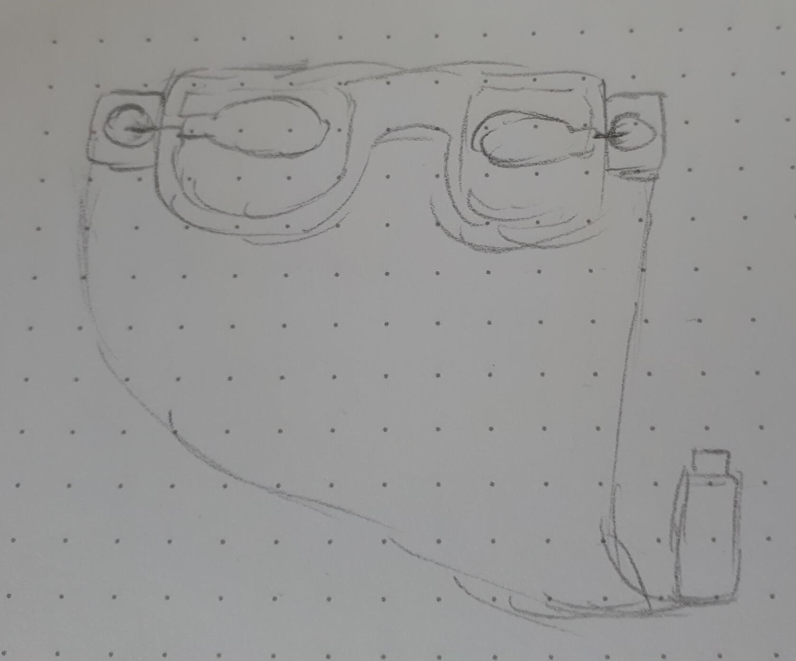

# Super glasses

## Abstract

The view through glasses can easily get blocked due to rain drops or fogging and 
for cleaning it must be taken off. Since this action can be a hassle, 
Super glasses can clean themselves by clicking on a button. 
Additionally, they can display emotions, as glasses tend to cover the eyebrows and 
big sunglasses even cover the eyes

## Introduction

The idea is to have wippers be attached to the glasses 
so that the glasses will clean themselves.
A button click starts the servo motors 
which perform the cleaning motion with the wippers on it.

<figure>
    
  <figcaption>A sketch of the idea</figcaption>
</figure>

## Related work 

(References to related concepts, projects, books, websites, stories, systems, fruits, etc. and their relation to the project at hand.)


The picture above shows a similar project which uses plastic pieces as windscreen wipers to move rain drops to the side of the glasses. 
For the movement it uses a small motor which is attached to the side of the glasses and connected to the plastic wipers via wires.
[Source](https://youtube.com/shorts/yv6GhCoSSO8?si=K6DPu0hzVph28PmN) 

## Implementation 

A detailed description of your prototyping process.

### Iteration №1

This did not work.

### Iteration №2

This did also not work.

### Iteration №3

This worked!

## Conclusion

A reflection on your prototyping process and the project outcome. What happens to the prototype after the project?