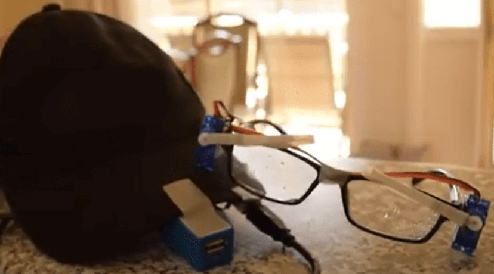
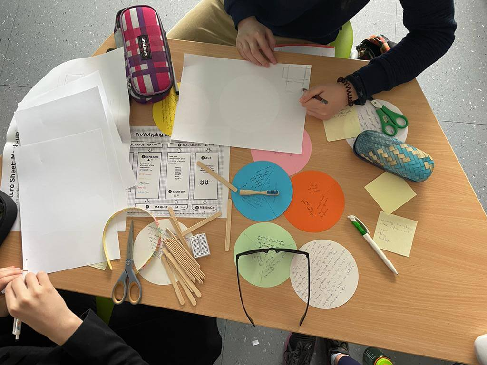

# Super glasses

## Abstract

The view through glasses can easily get blocked due to rain drops or fogging and 
for cleaning it must be taken off. Since this action can be a hassle, 
Super glasses can clean themselves by clicking on a button. 
Additionally, they can display emotions, as glasses tend to cover the eyebrows and 
big sunglasses even cover the eyes.

## Introduction

The idea for the project is to have wippers that are attached to the glasses 
so that the glasses can clean themselves. A button click starts two servo motors which are attached to the temples of the glasses next to the spectacle lens. They perform the cleaning motion with the wippers on it.

<figure id="sketch">
    
  <figcaption><em>A sketch of the idea</em></figcaption>
</figure>

This documentation contains three more sections. The next section related work presents books, websites and similar projects which give an introduction to the inexperienced reader. In the section Implementation the iterations of the build process are presented. Also the code and the construction of the project will be presented in a detailed way. The last sections contains the conclusion. It finishes this documentation with a short reflection and the summarised project outcome. 

## Related work

For the Project Super Glasses a microcontroller is needed for the logic. 
At the beginning the Arduino Uno was used. 
Later it was replaced by an ESP32 to trigger the actions like clean via a website. 
These two Microcontrollers are both popular. 
Consequently, there are a lot of projects presented on the internet on several websites and blogs 
which make use of one of these Microcontrollers. 
One reference about how to build an asynchronus web server with the ESP32 is published on the website [Random Nerd Tutorials](https://randomnerdtutorials.com/esp32-async-web-server-espasyncwebserver-library/). 
The tutorial shows how to control three LEDs which are placed on a breadboard and connected to the ESP32. 

Moreover, the two microcontrollers are also present in the literature. 
For example the Rheinwerk publishing house published the books [Arduino](https://www.rheinwerk-verlag.de/arduino-das-umfassende-handbuch/) and [ESP32](https://www.rheinwerk-verlag.de/mikrocontroller-esp32-das-umfassende-handbuch/) 
which give a good introduction to the world of Microcontrollers.

After the decision to build windscreen wipers for glasses, the research on the internet showed that other people also had the same idea. In the following some related projects are presented which are published on the video platform YouTube.

<figure id="sketch">
    
  <figcaption><em>Project from Deffinite CoRen</em></figcaption>
</figure>

The picture above shows a project which is related to the idea to wash away raindrops. 
The construction is slightly different. It uses just one motor that can rotate 360°. 
Similarly to the presented project it is attached to the side of the glasses. 
For the wipers it uses plastic pieces which are each attached to the top of a spectacle lens. 
They are connected to the motor via wires. [Source](https://youtube.com/shorts/yv6GhCoSSO8?si=K6DPu0hzVph28PmN) 

<figure id="sketch">
    
  <figcaption><em>Project from Benjamin King</em></figcaption>
</figure>

The next related project Wiper Glassez from Benjamin King shown in the picture above also tries to solve the problem of fogged glasses. 
The creator also refers to it as a Chindogu. 
Additionally, the construction of the glasses gets really close to the presented one. 
It uses two servo motors which are attached to the temples of the glasses next to the spectacle lens. 
The windscreen wipers are directly on top of the servo motors. 
So that they follow the movement of the motors. 
For the logic it uses an Arduino which is attached with the rest of the equipment like the breadboard to a cap. 
As an extension, it uses a moisture sensor to trigger the movement.
[Source](https://www.youtube.com/watch?v=jDX6aNAMXfQ) 

## Implementation 
 This section contains a detailed description of the prototyping process.

### Paper Prototyping Session

At the beginning a paper prototype with additional real sunglasses, a battery and a small breadboard was built in a prototyping session to make the idea quickly tangible. The following pictures show some impressions of this session. The sunglasses had windscreen wipers built with popsicle sticks and paper. The Arduino was also rebuilt with paper. The fake Arduino, the battery and the breadboard were attached to a hairband. Furthermore the prototype had a rain cover to protect the electronics. Of couse this version of the prototype did not had any functionality but the design was already very similar to the later versions of the prototype.

<figure>
    
  <figcaption>The picture shows the build process of the paper prototype</figcaption>
</figure>
<figure>
    
  <figcaption>A picture of the finished paper prototype</figcaption>
</figure>
<figure>
    
  <figcaption>A picture of the finished paper prototype with a rain cover</figcaption>
</figure>

### First version with the Arduino

Our first try still had a real push button and was made with an Adruino. 
The wippers consisted of popsicle sticks and sponges as 
the width of the stick prevented the sponge from rotating. 
<figure>
    
  <figcaption><em>First Version from the front</em></figcaption>
</figure>
Using our knowledge from the lessons we built our circuit 
which can be seen on <a href="#v01circuit">the picture <em>First version's circuit</em></a>. 
While the circuit looks simple, <a href="#v01real">the photo <em>The cabeling in real life</em></a> shows that the implementation looks like a mess
as there are many wires in a narrow space. 
To make the cabling reproducible, there is <a href="#v01img">the image <em>The cabeling as a diagram</em></a>. 
<figure id="v01circuit">
    
  <figcaption><em>First version's circuit</em></figcaption>
</figure>
<figure id="v01real">
    
  <figcaption><em>The cabling in real life</em></figcaption>
</figure>
<figure id="v01img">
    
  <figcaption><em>The cabling as a diagram</em></figcaption>
</figure>

The complete code of the first version can be found on the subpage [First version's code](). 
The code works the following way: The Arduino continuously listens whether the button has been pressed or not. 
If it has been, the pin position will be attached to the servo and then the servos move the wippers once down and up.
Afterward the pin position will be detached.

### Second version with the ESP32

This worked!

### Time to solder

### Building a case

<figure>
    
  <figcaption><em>Scetches for the case with different themes</em></figcaption>
</figure>
<figure>
    
  <figcaption><em>The case for the ESP32 and the battery from the side</em></figcaption>
</figure>
<figure>
    
  <figcaption><em>The case for the ESP32 and the battery from the top</em></figcaption>
</figure>
### 3D print the wippers

## Conclusion

A reflection on your prototyping process and the project outcome. What happens to the prototype after the project?