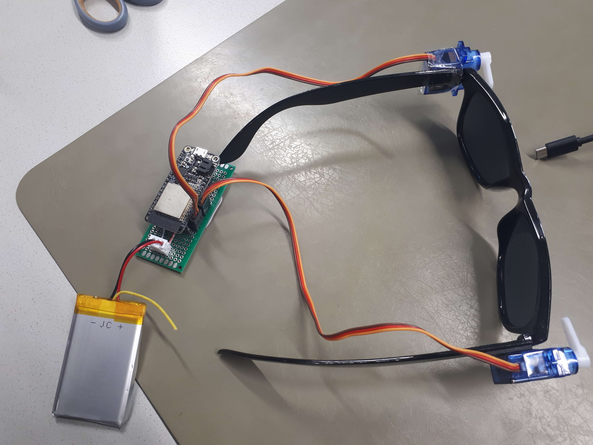

# Super glasses

## Abstract

The view through glasses can easily get blocked due to rain drops or fogging and 
for cleaning it must be taken off. Since this action can be a hassle, 
Super glasses can clean themselves by clicking on a button. 
Additionally, they can display emotions, as glasses tend to cover the eyebrows and 
big sunglasses even cover the eyes.

## Introduction

The idea for the project is to have wipers that are attached to the glasses 
so that the glasses can clean themselves. A button click starts two servo motors 
which are attached to the temples of the glasses next to the spectacle lens. 
They perform the cleaning motion with the wipers on it.

<figure id="sketch">
    
  <figcaption><em>A sketch of the idea</em></figcaption>
</figure>

This documentation contains three more sections. 
The next section <em>Related work</em> presents books, websites and similar projects 
that give an introduction to the inexperienced reader. 
In the section <em>Implementation</em>, the iterations of the build process are presented. 
Likewise, the code and the construction of the project will be presented in a detailed way. 
The last section contains the conclusion. 
It finishes this documentation with a short reflection and the summarized project outcome. 

## Related work

For the Project Super Glasses, a microcontroller is needed for the logic. 
At the beginning, the Arduino Uno was used. 
Later, it was replaced by an ESP32 to trigger actions like cleaning via a website. 
These two Microcontrollers are both popular. 
Consequently, there are numerous projects presented on the internet on several websites and blogs, 
which make use of one of these Microcontrollers. 
One reference about how to build an asynchronous web server with the ESP32 is published on the website [Random Nerd Tutorials](https://randomnerdtutorials.com/esp32-async-web-server-espasyncwebserver-library/). 
The tutorial shows how to control three LEDs, which are placed on a breadboard and connected to the ESP32. 

Moreover, the two microcontrollers are also present in the literature. 
For example, the Rheinwerk publishing house published the books [Arduino](https://www.rheinwerk-verlag.de/arduino-das-umfassende-handbuch/) and [ESP32](https://www.rheinwerk-verlag.de/mikrocontroller-esp32-das-umfassende-handbuch/) 
which give a good introduction to the world of Microcontrollers.

After the decision to build windscreen wipers for glasses, 
the research on the internet showed that other people also had the same idea. 
In the following, some related projects are presented, which are published on the video platform YouTube.

<figure id="sketch">
    
  <figcaption><em>Project from Deffinite CoRen</em></figcaption>
</figure>

The picture above shows a project which is related to the idea to wash away raindrops. 
The construction is slightly different. It uses just one motor that can rotate 360°. 
Similarly to the presented project, it is attached to the side of the glasses. 
For the wipers, it uses plastic pieces which are each attached to the top of a spectacle lens. 
They are connected to the motor via wires. [Source](https://youtube.com/shorts/yv6GhCoSSO8?si=K6DPu0hzVph28PmN) 

<figure id="sketch">
    
  <figcaption><em>Project from Benjamin King</em></figcaption>
</figure>

The next related project Wiper Glassez from Benjamin King shown in the picture above also tries to solve the problem of fogged glasses. 
The creator also refers to it as a Chindogu. 
Additionally, the construction of the glasses gets really close to the presented one. 
It uses two servo motors which are attached to the temples of the glasses next to the spectacle lens. 
The windscreen wipers are directly on top of the servo motors. 
So that they follow the movement of the motors. 
For the logic it uses an Arduino which is attached with the rest of the equipment like the breadboard to a cap. 
As an extension, it uses a moisture sensor to trigger the movement.
[Source](https://www.youtube.com/watch?v=jDX6aNAMXfQ) 

## Implementation 
 This section contains a detailed description of the prototyping process.

### Paper Prototyping Session

Initially, a paper prototype with the addition of real sunglasses, 
a battery and a small breadboard was built in a prototyping session to make the idea quickly tangible. 
The following pictures show some impressions of this session. 
The sunglasses had windscreen wipers built with popsicle sticks and paper. 
The Arduino was also rebuilt with paper. 
The fake Arduino, the battery and the breadboard were attached to a hairband. 
Furthermore, the prototype had a rain cover to protect the electronics. 
Of course, this version of the prototype did not have any functionality, 
but the design was already very similar to the later versions of the prototype.

<figure>
    
  <figcaption><em>The build process of the paper prototype</em></figcaption>
</figure>
<figure>
    
  <figcaption><em>The finished paper prototype</em></figcaption>
</figure>
<figure>
    
  <figcaption><em>The finished paper prototype with a rain cover</em></figcaption>
</figure>

### First version with the Arduino

Our first try still had a real push button and was made with an Arduino. 
The wipers consisted of popsicle sticks and sponges as 
the width of the stick prevented the sponge from rotating. 
<figure>
    
  <figcaption><em>First Version from the front</em></figcaption>
</figure>
Using our knowledge from the lessons we built our circuit 
which can be seen on <a href="#v01circuit">the picture <em>First version's circuit</em></a>. 
While the circuit looks simple, <a href="#v01real">the photo <em>The cabling in real life</em></a> shows that the implementation looks like a mess
as there are many wires in a narrow space. 
To make the cabling reproducible, there is <a href="#v01img">the image <em>The cabling as a diagram</em></a>. 
<figure id="v01circuit">
    
  <figcaption><em>First version's circuit</em></figcaption>
</figure>
<figure id="v01real">
    
  <figcaption><em>The cabling in real life</em></figcaption>
</figure>
<figure id="v01img">
    
  <figcaption><em>The cabling as a diagram</em></figcaption>
</figure>

The complete code of the first version can be found on the subpage [First version's code](). 
The code works the following way: The Arduino continuously listens whether the button has been pressed or not. 
If it has been, the pin position will be attached to the servo and then the servos move the wipers once down and up.
Afterward, the pin position will be detached.

### Second version with the ESP32

After knowing the ESP32 we decided to use it instead of the Arduino 
because the wearer would not need to search for the push button on their head anymore
as it would exist on the smartphone. Since there is enough space on the website 
we also decided to implement additional buttons which show emotions with the wipers. 
The end version has in total seven buttons: 
<ul>
    <li>Reset</li>
    <li>Clean</li>
    <li>Shock</li>
    <li>Raised Eyebrow</li>
    <li>Anger</li>
    <li>Wiggle</li>
    <li>Random</li>
</ul>
The website is styled with CSS so that the buttons are bigger and 
that the states <code>hover</code> and <code>active</code> 
are better visible. <a href="#website_states">The picture <em>The website with different button states</em></a> 
shows on the left screen the buttons in the default state, on the middle one is <em>Clean</em> in the <code>hover</code> state 
and on the right one is <em>Clean</em> in the <code>active</code> state.

<figure id="website_states">
    
  <figcaption><em>The website with different button states</em></figcaption>
</figure>

The complete code of the final version can be found on the subpage [Final version's code](). 
The code works the following way: When the ESP is connected to the WLAN with the given name and password, 
the built-in LED will be on as long the microcontroller is connected to the WLAN.
Additionally, the ESP32 will print to the Serial Monitor the address where the website will be shown.
Every button on the website has an ID and an <code>EventListener</code> 
which sends the ID to the ESP when the button is pressed. 
As the ID tells which button has been pressed, 
the corresponding action can then be performed.
Afterward, the ESP32 updates the website with the <code>h1</code> 
being the last pressed button. 
The title change exists for debugging so that we know 
if the code was iterated in case the action did not happen.

### Time to solder

To reduce the number of cables needed and to prevent them from detaching,
we decided to solder. 
<a href="#vendcircuit">The image <em>Final version's circuit</em></a>
shows, as its name suggests, the final circuit. 
On <a href="#solderbelow">the photo <em>The PCB from below</em></a> , one can see how we soldered. 
<a href="#vendimg">The image <em>The final cabling as a diagram</em></a> 
is the translation of the soldering as a diagram.
<a href="#vendcomp">The photo <em>The result of the soldering</em></a> 
shows that the battery, the ESP32 and the servo motors are now connected to the PCB.
By putting the battery below the PBC, what the user needs to wear 
becomes even more compact as they can be put into one case. 

<figure id="vendcircuit">
    
  <figcaption><em>Final version's circuit</em></figcaption>
</figure>
<figure id="solderbelow">
    
  <figcaption><em>The PCB from below</em></figcaption>
</figure>
<figure id="vendimg">
    
  <figcaption><em>The final cabling as a diagram</em></figcaption>
</figure>
<figure id="vendcomp">
    
  <figcaption><em>The result of the soldering</em></figcaption>
</figure>

### Building a case

Constructing a case for the ESP32 and the battery aimed at safeguarding the components from external influences and making the prototype look more funny. Initial stages involved sketching various case designs on paper, each related to different themes like Halloween, winter, or summer. The photo <a href="#allThemes"><em>Sketches for the case with different themes</em></a> shows the result of this step. The summer-inspired design was to be the final version, as the prototype was built with sunglasses. After this decision, the exact design was planned. The photo <a href="#summerTheme"><em>detailed sketch of the case</em></a> shows the sketch made in this step. The finished case, which resembles a deckchair, was made using popsicle sticks and attached to the hairband. Additionally, a small red bucket filled with sand was crafted to support the summer theme. The photos <a href="#caseSide"><em>Case for the ESP32 and the battery from the side</em></a> and <a href="#caseTop"><em>Case for the ESP32 and the battery from the top</em></a> show the finished casing.

<figure id="allThemes">
    
  <figcaption><em>Sketches for the case with different themes</em></figcaption>
</figure>
<figure id="summerTheme">
    
  <figcaption><em>Detailed sketch of the case</em></figcaption>
</figure>
<figure id="caseSide">
    
  <figcaption><em>Case for the ESP32 and the battery from the side</em></figcaption>
</figure>
<figure id="caseTop">
    
  <figcaption><em>Case for the ESP32 and the battery from the top</em></figcaption>
</figure>

### 3D print the wipers

Since the popsicle is straight and the lens of the glasses is curved, 
the sponge does not cover the full lens. 
Therefore, we needed something curved which was hard and as broad as the popsicle. 
The last condition is necessary to prevent the sponge from spinning. 
As we did not find metal which fulfilled our conditions in the shops, 
we decided to 3D print the wipers. The model was created in Maya and 
then printed with the printer Prusa with PETG as the material. 
Two iterations were needed as the first version's hole 
which would connect the wiper with the motor was too big.
For the second version the hole was intentionally made a little bit smaller 
than necessary so that we could make adjustments with the drill.
The sponge is attached to the new wiper with glue.

<figure>
    
  <figcaption><em>3D model of the wiper in Maya with its sizes in cm</em></figcaption>
</figure>
<figure>
    
  <figcaption><em>The 3D printer finished printing the wipers.</em></figcaption>
</figure>
<figure>
    
  <figcaption><em>Close-up of the freshly printed wipers</em></figcaption>
</figure>

## Conclusion

A reflection on your prototyping process and the project outcome. 
What happens to the prototype after the project?

In conclusion, it was an interesting and enjoyable process 
from conceptualizing the idea to the development of the first prototype 
and the refinement into an almost practical product.
This project was also a good way to get an introduction into the FH maker space and the equipment there.
During the build process we learned new technical skills 
including ESP32 programming, soldering techniques, and 3D printing. 
Noteworthy among the challenges encountered was the debugging phase, 
where issues such as insufficient battery power for the integrated components were addressed. 
This process sometimes proved to be difficult when we did not know what was causing the problems
(e.g. broken motor, problem with software code, or insufficient power supply). 
Overall, the project served as a practical learning experience, 
fostering both technical and creative skills in the field of electronic engineering and prototyping.
After this project is now done, the prototype will probably be used as an interactive decoration piece for some time.
Later, the parts like motors and the chip might be reused for projects now that we how to work with the ESP32.